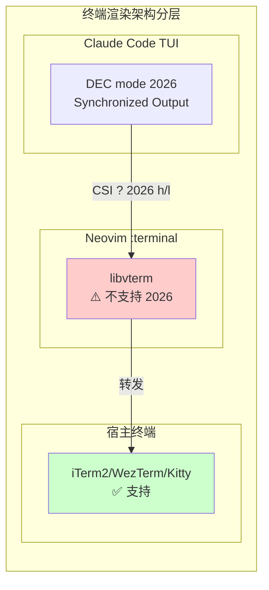
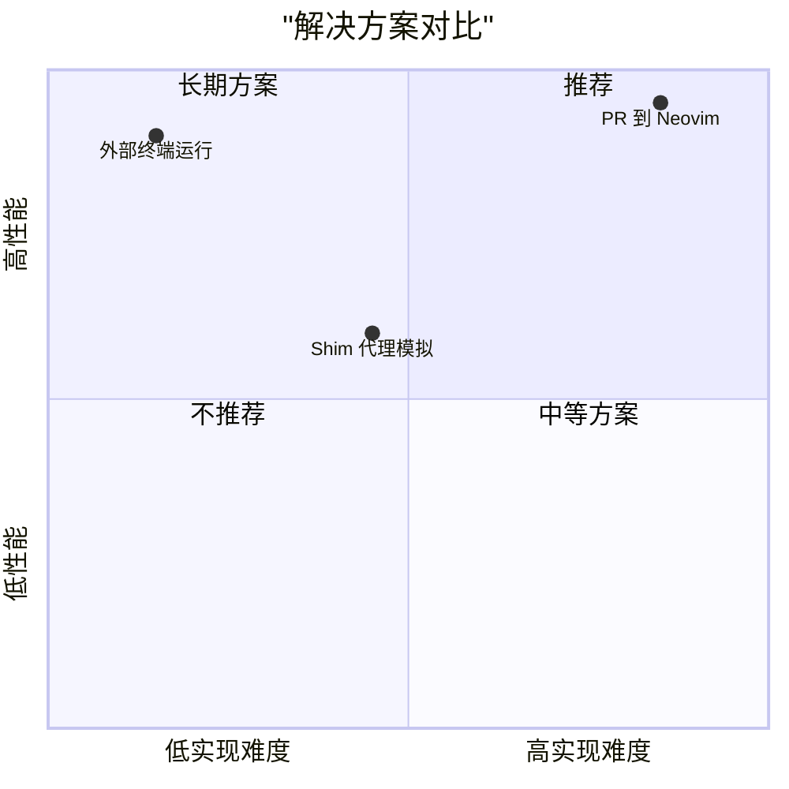
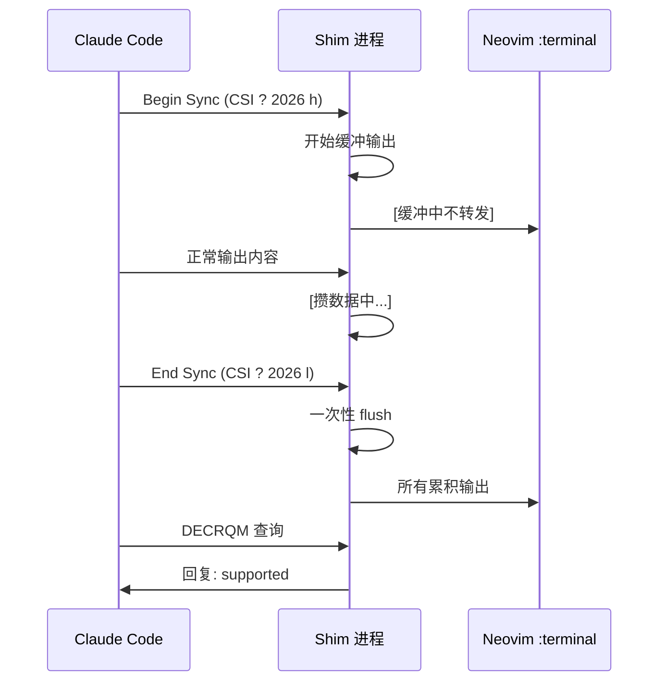
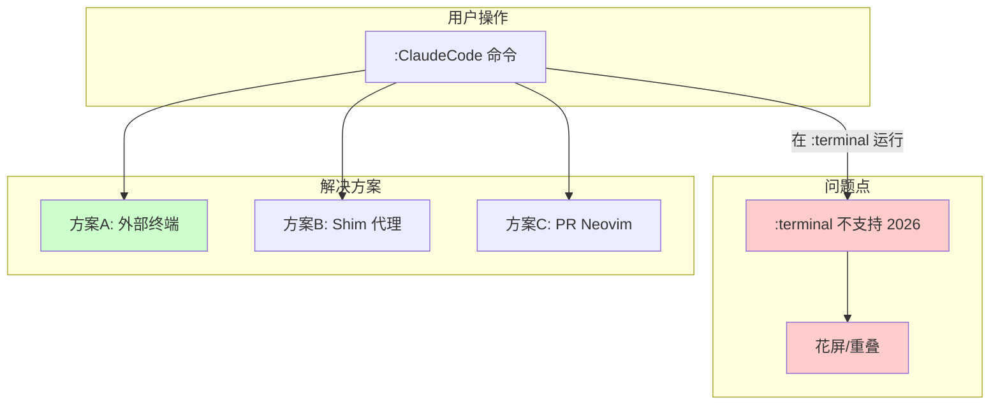

# Neovim TUI 问题与解决方案报告

## 问题概述

在 Neovim `:terminal` 中运行 Claude Code 等 TUI 程序时，出现花屏、字符重叠、光标定位错乱等问题。

> 相关 Issue: [claude-code#20436](https://github.com/anthropics/claude-code/issues/20436)

---

## Root Cause（根本原因）



**核心问题**：
- Claude Code TUI 使用 `DEC mode 2026` (Synchronized Output) 来批量刷新屏幕
- Neovim 内置 `:terminal` 基于 `libvterm`，**不支持**该模式
- 当终端收到 `CSI ? 2026 h/l` 时无法正确处理，导致渲染错乱

---

## 检测方法

使用 **DECRQM** 查询终端是否支持 DEC mode 2026：

```bash
# 发送查询
printf '\e[?2026$p' > /dev/tty
```

**返回结果解读**：

| 返回值 | 含义 |
|--------|------|
| `CSI ? 2026 ; 0 $ y` | ❌ 不支持 (not recognized) |
| `CSI ? 2026 ; 1 $ y` | ✅ 支持且已开启 |
| `CSI ? 2026 ; 2 $ y` | ✅ 支持但已关闭 |

**测试结果**：
```
# 在外层终端（WezTerm/Kitty等）
CSI ? 2026 ; 2 $ y  → 支持，但当前关闭

# 在 Neovim :terminal 中
CSI ? 2026 ; 0 $ y  → 不支持
```

这说明：
- 外层终端支持 2026
- Neovim `:terminal` 不支持 2026 ⬅️ **问题所在**

---

## 解决方案

### 方案对比



### 方案 A：外部终端运行（推荐）

直接在外部终端运行 Claude Code：

```bash
# 在 Neovim 中配置命令，自动打开外部终端
vim.api.nvim_create_user_command("ClaudeExternal", function()
  vim.fn.system(string.format("wezterm cli split-pane --claudecode", vim.fn.expand("%:p:h")))
end, {})
```

### 方案 B：Shim 代理模拟（中等成本）



**Python Shim 核心逻辑**：

```python
BEGIN = b'\x1b[?2026h'
END   = b'\x1b[?2026l'
QUERY = b'\x1b[?2026$p'

def handle_output(data):
    if BEGIN in data:
        sync_depth += 1  # 进入同步模式，开始缓冲
    elif END in data:
        sync_depth -= 1
        if sync_depth == 0:
            flush_buffer()  # 离开同步模式，一次性输出
    elif QUERY in data:
        reply_decrqm()  # 回复 DECRQM 查询
```

**性能影响**：
- 多一层 pty 转发，略有开销
- 同步期间缓冲数据，flush 时可能有短暂停顿
- 多数交互场景**几乎无感知**

### 方案 C：PR 到 Neovim（长期方案）

修改 Neovim vendored vterm 代码，实现 DEC mode 2026：

```c
// 需要修改的代码位置（示意）
// src/nvim/vterm/*.c

1. 识别 CSI ? 2026 h/l（Begin/End Synchronized Update）
2. 实现 DECRQM 查询响应
3. 在同步期间抑制即时渲染，关闭时一次性 flush
```

**注意**：Neovim 使用的是 vendored 到主仓库的 vterm，而非 `neovim/libvterm` 仓库。

---

## 架构总结图



---

## 推荐行动

1. **立即可用**：使用外部终端运行 Claude Code（方案 A）
2. **如果必须在内嵌终端用**：部署 Shim 代理（方案 B）
3. **长期方案**：向 neovim/neovim 提交 PR 实现 DEC mode 2026（方案 C）

---

## 参考链接

- [Claude Code Issue #20436](https://github.com/anthropics/claude-code/issues/20436)
- [Synchronized Output Spec (DEC mode 2026)](https://gist.github.com/christianparpart/d8a62cc1ab659194337d73e399004036)
- [Neovim :terminal 文档](https://neovim.io/doc/user/terminal.html)
- [Neovim vterm 源码](https://github.com/neovim/neovim/tree/master/src/nvim/vterm)
