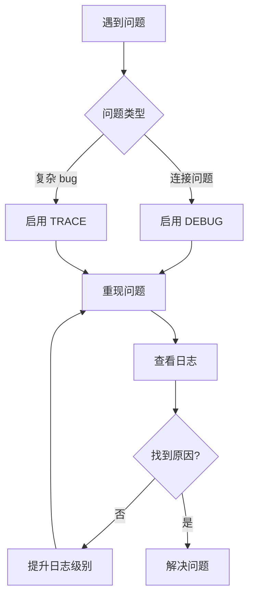

# ClaudeCode.nvim 调试日志使用指南

本指南介绍如何使用 DEBUG 和 TRACE 日志级别来调试 ClaudeCode.nvim，特别是断连和重连问题。

## 目录

1. [日志级别概述](#日志级别概述)
2. [快速开始](#快速开始)
3. [启用调试日志](#启用调试日志)
4. [查看日志](#查看日志)
5. [使用提供的工具](#使用提供的工具)
6. [实际调试案例](#实际调试案例)
7. [最佳实践](#最佳实践)

## 日志级别概述

ClaudeCode.nvim 支持以下日志级别（从最详细到最简略）：

| 级别 | 用途 | 日志量 | 性能影响 |
|------|------|--------|----------|
| **TRACE** | 深度调试，记录每个函数调用和状态变化 | 非常大 | 高 |
| **DEBUG** | 一般调试，记录关键决策点 | 中等 | 低 |
| **INFO** | 正常运行信息 | 少 | 极低 |
| **WARN** | 警告信息 | 很少 | 无 |
| **ERROR** | 错误信息 | 很少 | 无 |

## 快速开始

### 1. 启用 DEBUG 日志（推荐首选）

```lua
-- 在你的 Neovim 配置中
require("claudecode").setup({
  log_level = "debug",
})
```

### 2. 启用 TRACE 日志（深度调试）

```lua
-- 仅在需要详细追踪时使用
require("claudecode").setup({
  log_level = "trace",
})
```

### 3. 实时查看日志

```bash
# 查看所有日志
tail -f /tmp/claudecode_debug.log

# 只看重连相关日志
tail -f /tmp/claudecode_debug.log | grep reconnect
```

## 启用调试日志

### 方法 1：通过配置文件（推荐）

```lua
-- init.lua 或 init.vim 中
require("claudecode").setup({
  log_level = "debug",  -- 或 "trace"
  -- 其他配置...
})
```

### 方法 2：运行时切换

```vim
" 在 Neovim 中执行
:source ~/.vim/plugged/claudecode.nvim/scripts/enable_trace_logging.vim
```

### 方法 3：临时启用

```vim
" 在 Neovim 命令行执行
:lua require("claudecode.logger").setup({ log_level = "trace" })
```

## 查看日志

### 日志文件位置

日志默认保存在：`/tmp/claudecode_debug.log`

### 使用提供的日志查看工具

```bash
# 进入脚本目录
cd ~/.vim/plugged/claudecode.nvim/scripts/

# 运行日志查看器
./view_trace_logs.sh
```

工具提供以下选项：
1. **查看所有重连相关日志** - 显示所有级别的重连日志
2. **查看只有 TRACE 级别日志** - 过滤出 TRACE 日志
3. **查看重连 TRACE 日志** - 只显示重连模块的 TRACE 日志
4. **实时重连监控** - 彩色实时显示重连事件
5. **显示重连状态变化** - 查看状态转换
6. **清空日志文件** - 清理旧日志

### 手动查看命令

```bash
# 查看最近 50 条 DEBUG 日志
grep "\[DEBUG\]" /tmp/claudecode_debug.log | tail -50

# 查看最近 30 条 TRACE 日志
grep "\[TRACE\]" /tmp/claudecode_debug.log | tail -30

# 实时监控重连的 TRACE 日志
tail -f /tmp/claudecode_debug.log | grep -E "\[TRACE\].*\[reconnect\]"

# 查看特定时间段的日志
grep "14:32:" /tmp/claudecode_debug.log
```

## 使用提供的工具

### 1. 测试重连机制

```bash
# 运行重连测试脚本
cd ~/.vim/plugged/claudecode.nvim/scripts/
./test_reconnect.sh
```

### 2. 在 Neovim 中测试

```vim
" 加载测试命令
:source ~/.vim/plugged/claudecode.nvim/scripts/test_reconnect_command.vim

" 运行交互式测试
:ClaudeCodeTestReconnect
```

### 3. 查看连接健康状态

```vim
" 查看当前连接健康
:ClaudeCodeConnectionHealth

" 导出连接报告
:ClaudeCodeConnectionReport
```

## 实际调试案例

### 案例 1：调试断连问题

1. **启用 DEBUG 日志**
   ```vim
   :lua require("claudecode.logger").setup({ log_level = "debug" })
   ```

2. **重现问题**
   - 等待断连发生或手动触发

3. **查看日志**
   ```bash
   # 查看断连事件
   grep -A5 -B5 "disconnect" /tmp/claudecode_debug.log
   ```

4. **分析日志**
   ```
   [DEBUG] Handling disconnect: code=1006, reason='Connection timeout'
   [DEBUG] Disconnect code 1006 is reconnectable
   [INFO] Attempting reconnection 1/3
   ```

### 案例 2：调试重连失败

1. **启用 TRACE 日志**
   ```vim
   :lua require("claudecode.logger").setup({ log_level = "trace" })
   ```

2. **触发断连**
   ```vim
   :ClaudeCodeTestDisconnect
   ```

3. **实时监控**
   ```bash
   ./view_trace_logs.sh
   # 选择选项 4 (实时监控)
   ```

4. **分析详细流程**
   ```
   [TRACE] handle_disconnect() called: code=1006, enabled=true
   [TRACE] Checking if code 1006 should trigger reconnection
   [TRACE] attempt_reconnect() called, enabled=true
   [TRACE] Current state: retry_count=0, max_retries=3
   [TRACE] Opening terminal to launch Claude CLI
   [TRACE] Scheduling connection check in 5000ms
   [TRACE] Connection check result: false
   [TRACE] Calculated retry delay: base=2000ms, final=3000ms
   ```

## 最佳实践

### 1. 日志级别选择

| 场景 | 推荐级别 | 原因 |
|------|----------|------|
| 日常使用 | INFO | 最小性能影响 |
| 开发调试 | DEBUG | 足够的信息，适中的日志量 |
| 问题诊断 | TRACE | 完整的执行轨迹 |
| 生产环境 | WARN | 只记录问题 |

### 2. 调试流程



### 3. 性能考虑

- **TRACE 级别影响性能**，不建议长期开启
- 定期清理日志文件：
  ```bash
  # 清空日志
  > /tmp/claudecode_debug.log
  
  # 或使用工具
  ./view_trace_logs.sh
  # 选择选项 6
  ```

### 4. 日志过滤技巧

```bash
# 组合过滤
grep -E "\[(DEBUG|TRACE)\].*reconnect.*attempt" /tmp/claudecode_debug.log

# 排除某些日志
grep -v "\[TRACE\]" /tmp/claudecode_debug.log

# 按时间范围过滤
awk '/14:30:00/,/14:35:00/' /tmp/claudecode_debug.log
```

## 常见问题

### Q: 日志文件太大怎么办？

```bash
# 只保留最近 1000 行
tail -1000 /tmp/claudecode_debug.log > /tmp/claudecode_debug_new.log
mv /tmp/claudecode_debug_new.log /tmp/claudecode_debug.log
```

### Q: 如何只记录特定模块的日志？

目前需要手动过滤：
```bash
# 只看重连模块
grep "\[reconnect\]" /tmp/claudecode_debug.log

# 只看服务器模块
grep "\[server\]" /tmp/claudecode_debug.log
```

### Q: 如何在 Neovim 中直接查看日志？

```vim
" 在新标签页打开日志
:tabnew /tmp/claudecode_debug.log

" 自动滚动到末尾
:normal G

" 设置自动刷新
:set autoread
:au CursorHold * checktime
```

## 总结

- **开始调试时先用 DEBUG**，它通常能提供足够的信息
- **需要深入分析时才用 TRACE**，注意性能影响
- **善用提供的工具**，特别是 `view_trace_logs.sh`
- **实时监控**比事后分析更容易发现问题
- **定期清理日志**，避免占用过多磁盘空间

通过合理使用日志级别和工具，你可以快速定位和解决 ClaudeCode.nvim 的连接问题。